```{r setup, include=FALSE}
knitr::opts_chunk$set(echo = FALSE)

if(Sys.info()['user']=='janus829' | Sys.info()['user']=='s7m'){
	dropPath = '~/Teaching/netWorkshop/amenIntro/example/'
	gpath = '~/Teaching/netWorkshop/amenIntro/'
	gitPath = '~/Research/netsMatter/'
	dataPath = paste0(dropPath, 'inputData/')
	resultsPath = paste0(dropPath, 'outputData/') }

library(ggplot2)
library(reshape2)
library(dplyr)
library(gridExtra)
```

## Perhaps our first network

```{r, out.width= "600px",fig.align="center"}
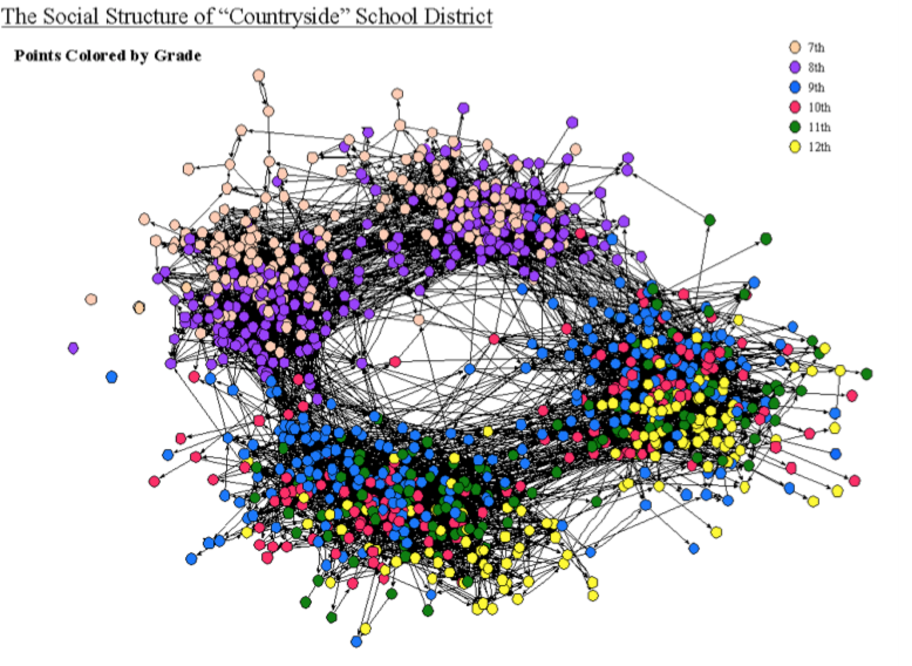
```

*Adolescent Social Structure* by **by Jim Moody**

## Can reveal surprising structure

```{r, out.width= "600px",fig.align="center"}
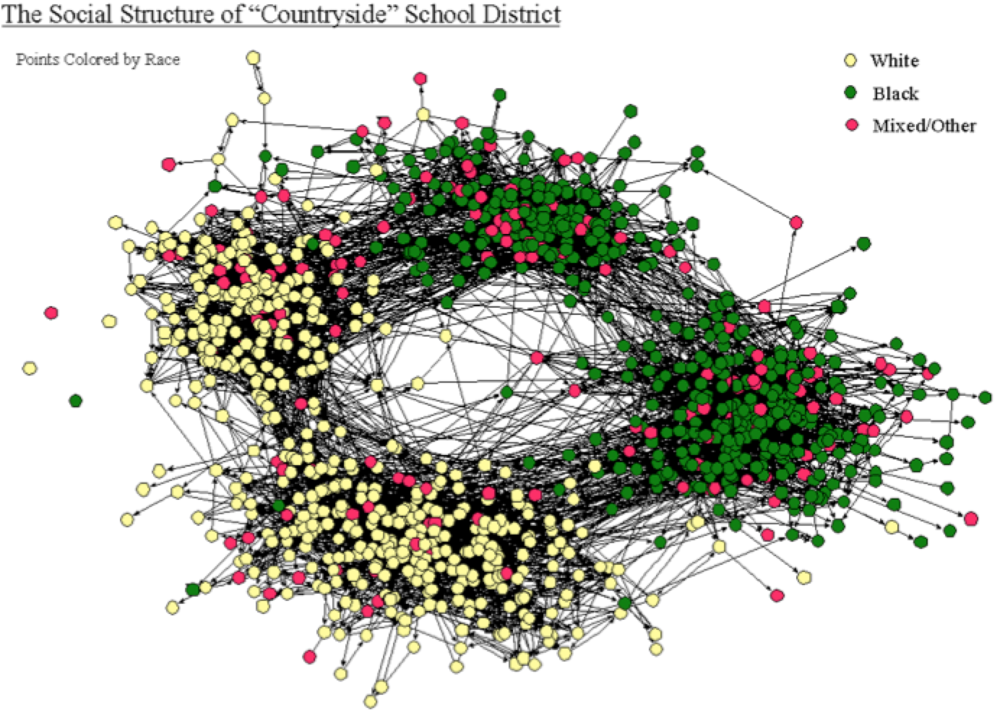
```

*Adolescent Social Structure* by **by Jim Moody**

## This used to be surprising

```{r, out.width= "700px",fig.align="center"}
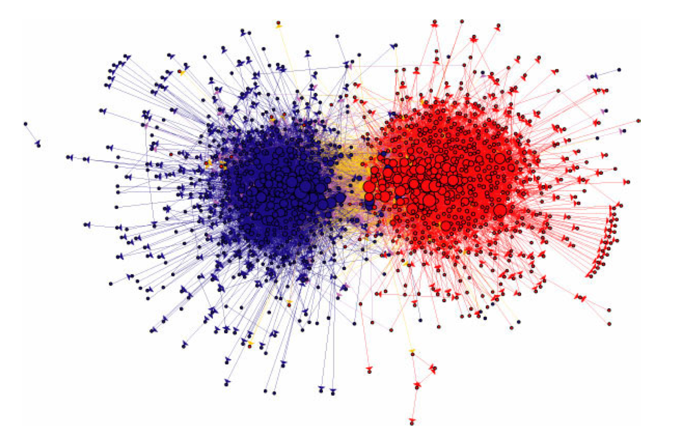
```

*The political blogosphere and the 2004 election: Divided they blog* by **Lada Adamic**

## Important hairballs

```{r, out.width= "550px",fig.align="center"}
knitr::include_graphics("proteinInteraction.jpg")
```

*Network Map of Protein-Protein Interactions* by **Erich E. Wanker of the Max Delbrück Center for Molecular Medicine (MDC)**

<!-- ## Why networks? -->

<!-- ```{r, out.width= "600px",fig.align="center"} -->
<!-- 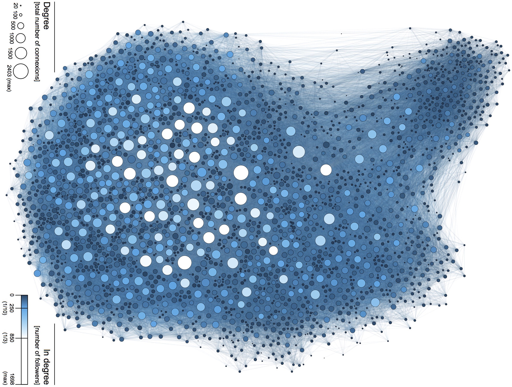 -->
<!-- ``` -->

<!-- *A social network analysis of Twitter: Mapping the digital humanities community* by **Grandjean & Mauro** -->

## Hairballs in Political Economy

```{r, out.width= "500px",fig.align="center"}
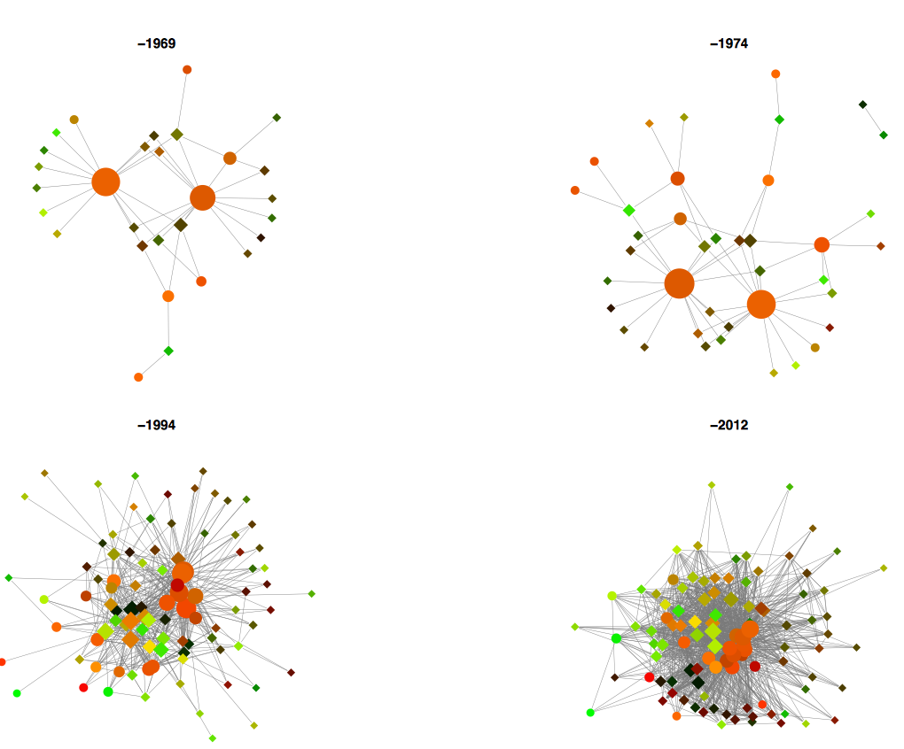
```

*BIT Formation*

## Structures do hide in hairballs ...

```{r, out.width= "700px",fig.align="center"}
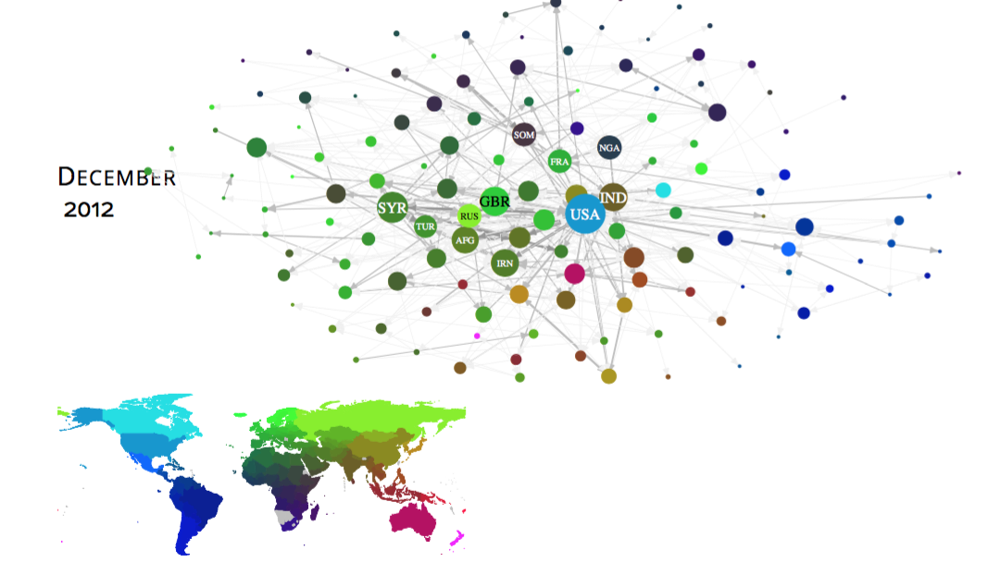
```

*International Conflict Event Warning System (ICEWS): Material Conflict* by **Minhas, Hoff, & Ward**

## Outline 

- **What makes network data particular?**
- **Social Relations Model**
- **Latent variable models**
- **Additive and Multiplicative Effect Networks (amen)**
- **Does it work? Real world application**
- **Does it work? Simulation exercise**
- **What's next?**

```{r, out.width= "275px",fig.align="right"}

```

## Relational data

Relational data consists of 

- a set of units or nodes
- a set of measurements, $y_{ij}$, specific to pairs of nodes (i,j) 

```{r, out.width= "800px",fig.align="center"}
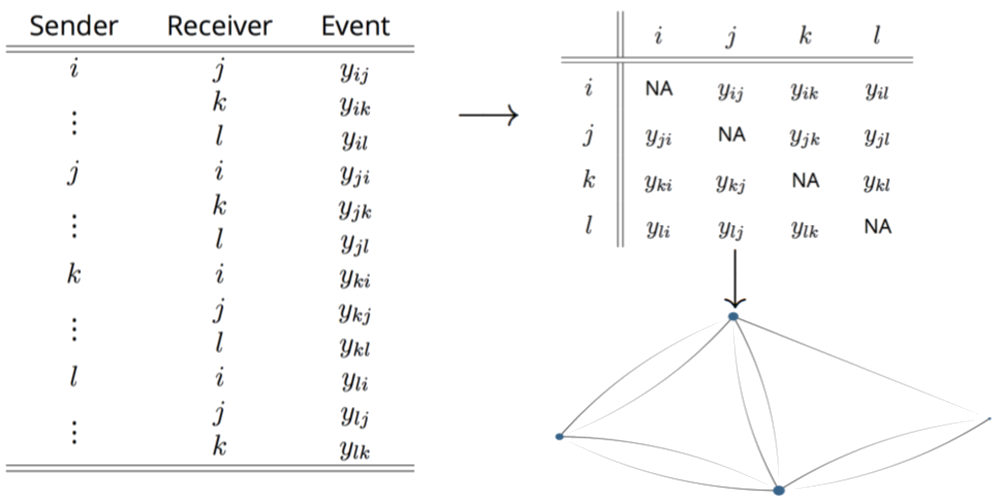
```

## What's wrong with GLM?

GLM: $y_{ij} \sim \beta^{T} X_{ij} + e_{ij}$

Networks typically show evidence against independence of {$e_{ij} : i \neq j$}

Not accounting for dependence can lead to:

- biased effects estimation
- uncalibrated confidence intervals
- poor predictive performance
- inaccurate description of network phenomena

We've been hearing this concern for decades now:

<div class="column-left">
Thompson & Walker (1982) <br>
Frank & Strauss (1986) <br>
Kenny (1996) <br>
Krackhardt (1998)
</div>
<div class="column-center">
Beck et al. (1998) <br>
Signorino (1999) <br>
Li & Loken (2002) <br>
Hoff and Ward (2004)
</div>
<div class="column-right">
Snijders (2011) <br>
Erikson et al. (2014) <br>
Aronow et al. (2015) <br>
Athey et al. (2016)
</div>

## Lets explore some data

```{r, echo=TRUE}
# library(devtools) ; devtools::install_github('s7minhas/amen')
library(amen) # Load additive and multiplicative effects pkg
data(IR90s) # Load trade data
```

```{r, echo=FALSE}
gdp = IR90s$nodevars[,2]
topgdp = which(gdp>=sort(gdp,decreasing=TRUE)[30] )
Y<-log( IR90s$dyadvars[topgdp,topgdp,2] + 1 )
```

```{r, echo=TRUE}
Y[1:5,1:5] # Data organized in an adjacency matrix
```

```{r, out.width= "600px",fig.align="left"}
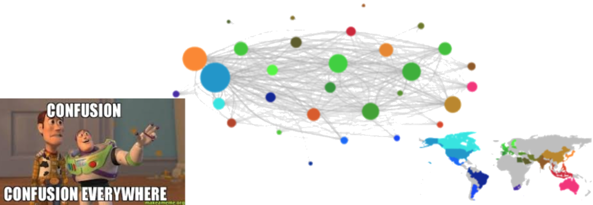
```

## Parsing the hairball - Nodal Effects

```{r, echo=FALSE, out.width="800px", fig.align="center"}
load(paste0(gpath, 'tradeMapCols.rda'))
effPlot = function(dimID, ylabel, colors=ccols, net=Y){
  globalMean = mean(Y, na.rm = TRUE)
  avgActivity = apply(net, dimID, mean, na.rm=TRUE)
  avgActivity_demean = avgActivity - globalMean
  muDf = data.frame(mu=avgActivity_demean)
  muDf$id = rownames(muDf)
  muDf$id = factor(muDf$id, levels=muDf$id[order(muDf$mu)])
  muDf$ymax = with(muDf, ifelse(mu>=0,mu,0))
  muDf$ymin = with(muDf, ifelse(mu<0,mu,0))
  gg = ggplot(muDf, aes(x=id, y=mu, color=id)) +
    geom_point() +
    geom_linerange(aes(ymax=ymax,ymin=ymin)) +
    xlab('') + ylab(ylabel) +
    scale_color_manual(values=colors) + 
    theme(
      legend.position='none',
      axis.ticks=element_blank(),
      axis.text.x=element_text(angle=45, hjust=1)
    )
  return(gg)
}
grid.arrange(effPlot(1, 'Avg. Log(Exports)'), effPlot(2, 'Avg. Log(Imports)'), nrow=2)
```

## Parsing the hairball - Covariance

```{r, out.width="800px", fig.align="center"}
senColEff = data.frame(
  exp=apply(Y, 1, mean, na.rm=TRUE),
  imp=apply(Y, 2, mean, na.rm=TRUE))
senColEff$id = rownames(senColEff)

ggplot(senColEff, aes(x=exp, y=imp,label=id, color=id)) +
  geom_text() +
  geom_abline(slope=1, intercept=0, linetype='dashed', color='grey60') + 
  ylab('Avg. Log(Imports)') + xlab('Avg. Log(Exports)') +
  scale_color_manual(values=ccols) + 
  theme(
    legend.position = 'none',
    axis.ticks=element_blank())
```

## Anything else going on ... reciprocity?

```{r, out.width="800px", fig.align="center"}
usa = na.omit(data.frame(send=Y['USA',], rec=Y[,'USA']))
usa$id = rownames(usa)
dat = data.frame(x=c(min(usa$send),max(usa$send)), ymin=min(usa$rec),
                 y=c(max(usa$rec),min(usa$rec)), ymax=max(usa$rec))

ggplot(data=usa, aes(x=send, y=rec, label=id, color=id)) +
  geom_text() + 
  geom_abline(slope=1, intercept=0, linetype='dashed', color='grey60') + 
  ylab('Log(Imports) into USA') + xlab('Log(Exports) from USA') +
  scale_color_manual(values=ccols) + 
  theme(
    legend.position = 'none',
    axis.ticks=element_blank())  
```

## Is the USA just lucky?

```{r, echo=TRUE}
# Reciprocity
cor(c(Y), c(t(Y)), use='complete')
```

```{r, echo=TRUE, eval=TRUE}
# Reciprocity beyond nodal variation?
senMean = apply(Y, 1, mean, na.rm=TRUE)
recMean = apply(Y, 2, mean, na.rm=TRUE)
globMean = mean(Y, na.rm=TRUE)
resid <- Y - ( globMean + outer(senMean,recMean,"+"))
cor(c(resid), c(t(resid)), use='complete')
```

<!-- ## Flavors of dependencies -->

<!-- * First order dependence -->
<!--       - Often will find significant heterogeneity in activity levels across nodes -->
<!-- * Second order dependence -->
<!--       - Reciprocity: Event sent from i $\rightarrow$ j is likely related to an event sent from j $\rightarrow$ i -->

## Social Relations Model

- The patterns mentioned above can be represented by the following model (Warner et al. 1979; Li & Loken 2002):

$$
\begin{aligned}
      y_{ij} &= \mu + e_{ij} \\
      e_{ij} &= a_{i} + b_{j} + \epsilon_{ij} \\
      \{ (a_{1}, b_{1}), \ldots, (a_{n}, b_{n}) \} &\sim N(0,\Sigma_{ab}) \\ 
      \{ (\epsilon_{ij}, \epsilon_{ji}) : \; i \neq j\} &\sim N(0,\Sigma_{\epsilon}), \text{ where } \\
      \Sigma_{ab} = \begin{pmatrix} \sigma_{a}^{2} & \sigma_{ab} \\ \sigma_{ab} & \sigma_{b}^2   \end{pmatrix} \;\;\;\;\; &\Sigma_{\epsilon} = \sigma_{\epsilon}^{2} \begin{pmatrix} 1 & \rho \\ \rho & 1  \end{pmatrix}
\end{aligned}
$$

## What can we do with this? 

- Capture some interesting features of networks ...
- ... but what about exogenous explanatory variables?

$$
\begin{aligned}
y_{i,j} = \beta_d^T \textbf{x}_{d,i,j} + \beta_r^T \textbf{x}_{r,i} +\beta_c^T \textbf{x}_{c,j} +  a_i + b_j +  \epsilon_{i,j}
\end{aligned}
$$
Variables we might want to include:

<div class="column-left">
- Log(Pop.) of $i$ and $j$
- Log(GDP) of $i$ and $j$
- Polity of $i$ and $j$
</div>
<div class="column-center">
- Number of conflicts from $i$ to $j$
- Log(Distance) between $i$ and $j$
</div>
<div class="column-right">
- Log Number of common IGOs between $i$ and $j$
</div>

## Probit Regression Framework

(Hoff 2005; Westveld & Hoff 2010; Hoff et al. 2013; Fosdick & Hoff 2015; Minhas et al. 2016)

**Threshold model**: linking latent $Z$ to $Y$
 
- $y_{ij} = 1(z_{ij}>0)$
- $z_{ij} = \beta^{T} x_{ij} + e_{ij}$

**Social relations model**: inducing network covariance

- $e_{ij} = a_{i} + b_{j} + \epsilon_{ij}$
- $\{(a_{1},b_{1}),\ldots,(a_{n},b_{n})\} \sim N(0, \Sigma_{ab})$
- $\{(\epsilon_{ij},\epsilon_{ji}) i \neq j \} \sim N(0, \Sigma_{\epsilon})$

## Gibbs Sampler for A~~M~~EN

- $p(Z, \beta, a, b, \Sigma_{ab}, \Sigma_{\epsilon} | Y, X)$

## Running the model in R

An MCMC routine providing a fit to an additive and multiplicative effects (AME) regression model to relational data of various type

```{r, out.width= "400px",fig.align="center"}
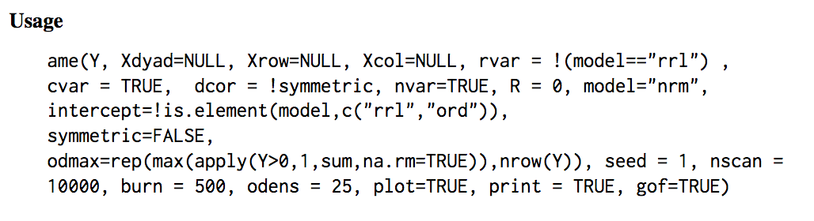
```

**Arguments**: 

<div class="column-leftHalf">
```{r, out.width= "400px",fig.align="left"}
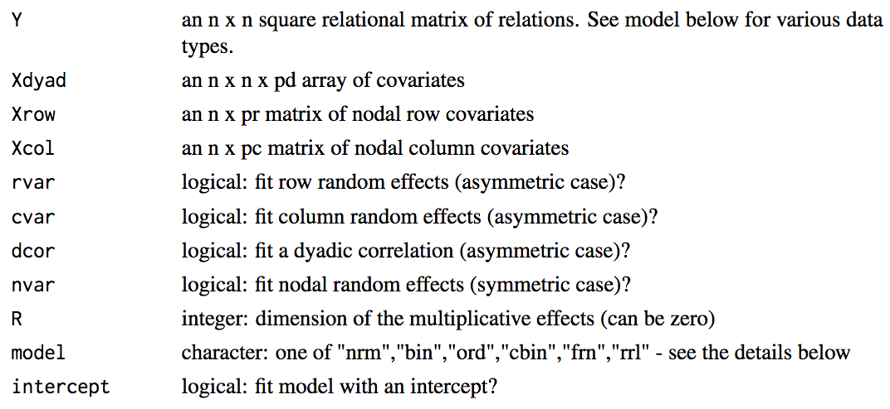
```
</div>
<div class="column-rightHalf">
```{r, out.width= "400px",fig.align="right"}
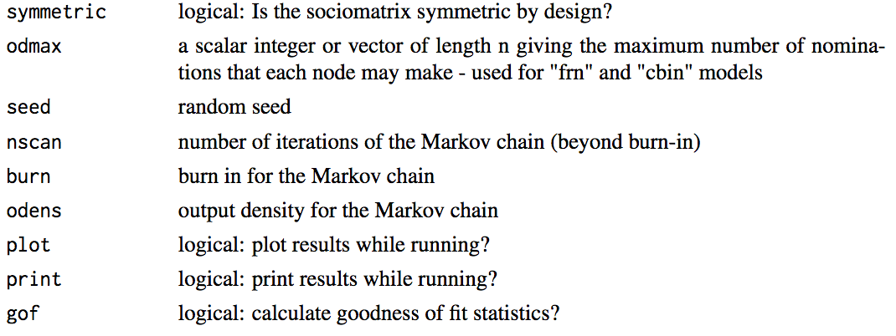
```
</div>

## Inputting nodal covariates

Nodal covariates should be structured as:

- an $n \times p$ matrix of covariates, where $n$ corresponds to number of actors and $p$ covariates
- In the directed case, row and nodal covariates need to be inputted separately into **`Xrow`** and **`Xcol`**

```{r}
load(paste0(gpath, 'tradeExampleData.rda'))
```

```{r, echo=TRUE}
Xn[1:10,]
```

## Inputting dyadic covariates

Dyadic covariates should be structured as: 

- an $n \times n \times p$ array of covariates, where $p$ now corresponds to the number of dyadic covariates

```{r, echo=TRUE, eval=FALSE}
Xd[1:3,1:3,]
```

<div class="column-left">
```{r, echo=TRUE, eval=FALSE}
conflicts
```
```{r, echo=FALSE, eval=TRUE}
Xd[1:3,1:3,1]
```
</div>
<div class="column-center">
```{r, echo=TRUE, eval=FALSE}
distance
```
```{r, echo=FALSE, eval=TRUE}
Xd[1:3,1:3,2]
```
</div>
<div class="column-right">
```{r, echo=TRUE, eval=FALSE}
shared_igos
```
```{r, echo=FALSE, eval=TRUE}
round(Xd[1:3,1:3,3], 2)
```
</div>

## Running SRM model with covariates

```{r, echo=TRUE, eval=FALSE}
fitSRM = ame(Y=Y,
             Xdyad=Xd, # incorp dyadic covariates
             Xrow=Xn, # incorp sender covariates
             Xcol=Xn, # incorp receiver covariates
             symmetric=FALSE, # tell AME trade is directed
             intercept=TRUE, # add an intercept             
             model='nrm', # model type
             rvar=TRUE, # sender random effects (a)
             cvar=TRUE, # receiver random effects (b)
             dcor=TRUE, # dyadic correlation
             R=0, # we'll get to this later
             nscan=10000, burn=5000, odens=25,
             plot=FALSE, print=FALSE, gof=TRUE
             )
```

```{r, echo=FALSE}
load(paste0(gpath, 'tradeSRM.rda'))
```

**objects returned in `fitSRM`**
```{r, echo=TRUE, eval=TRUE}
names(fitSRM)
```

## $\beta$ trace plot & distribution

```{r, echo=TRUE, eval=FALSE}
paramPlot(fitSRM$BETA)
```

<div class="column-leftHalf">
```{r, out.width= "350px",fig.align="left"}
knitr::include_graphics(paste0(gpath,'tradeSRM_beta1.png'))
```
</div>
<div class="column-righttHalf">
```{r, out.width= "350px",fig.align="left"}
knitr::include_graphics(paste0(gpath,'tradeSRM_beta2.png'))
```
</div>

## SRM variance parameters

```{r, echo=TRUE, eval=FALSE}
grid.arrange( paramPlot(fitSRM$VC),
  arrangeGrob( abPlot(fitSRM$APM, 'Sender Effects'),
               abPlot(fitSRM$BPM, 'Receiver Effects') ), ncol=2 )
```

```{r, out.width="800px",fig.align="left"}
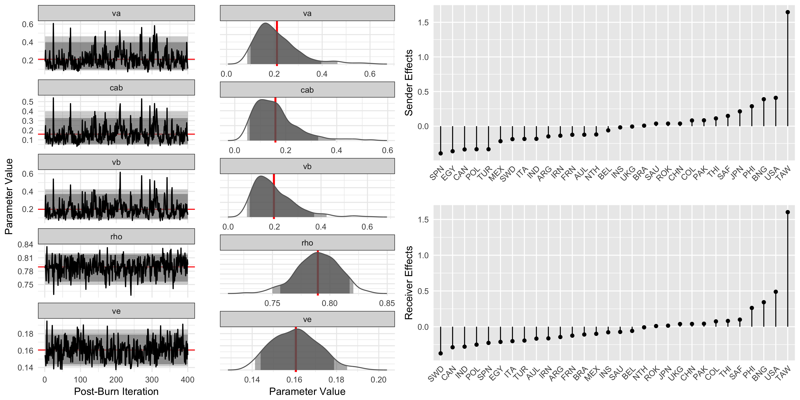
```

## Capturing network features?

```{r, echo=TRUE, eval=TRUE, out.width="800px", fig.align="center", warning=FALSE, message=FALSE}
gofPlot(fitSRM$GOF, symmetric=FALSE)
```

<!-- ```{r, out.width="100px",fig.align="bottomright"} -->
<!-- knitr::include_graphics("clarkson.jpg") -->
<!-- ``` -->

## What are we missing?

```{r, out.width= "700px",fig.align="center"}
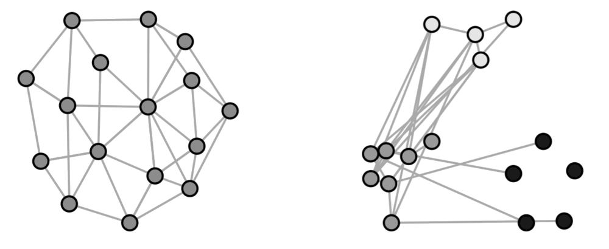
```

- **Homophily**: "birds of a feather flock together"
- **Stochastic equivalence**: nothing as pithy to say here, but this model focuses on community detection

Lets build on what we have so far and find an expression for $\gamma$:

$$
y_{ij} \approx \beta^{T} X_{ij} + a_{i} + b_{j} + \gamma(u_{i},v_{j}) 
$$

## Latent class model/blockmodels

(Holland et al. 1983; Nowicki & Snijders 2001; Rohe et al. 2011; Airoldi et al. 2013)

Each node $i$ is a member of an (unknown) latent class:

$$
\textbf{u}_{i} \in \{1, \ldots, K \}, \; i \in \{1,\ldots, n\} \\
$$
The probability of a tie between $i$ and $j$ is:

$$
Pr(Y_{ij}=1 | \textbf{u}_{i}, \textbf{u}_{j}) = \theta_{\textbf{u}_{i} \textbf{u}_{j}}
$$

* Nodes in the network may have a small or high probability of ties: $\theta_{kk}$ may be small or large
* Nodes in the same class are stochastically equivalent

**Software packages**: 

- CRAN: `statnet` (Handcock et al. 2016)
- CRAN: `blockmodels` (Leger 2015)

## LCM for community detection

<div class="column-leftHalf">
Newman (2006): <span style="color:green>Adjectives</span> and <span style="color:red>Nouns</span>
```{r, out.width= "350px",fig.align="left"}
knitr::include_graphics(paste0(gpath,'newman2006.png'))
```
</div>
<div class="column-righttHalf">
White & Murphy (2016): Mixed membership stochastic block model
```{r, out.width= "350px",fig.align="left"}
knitr::include_graphics(paste0(gpath,'whiteMurphy2016.png'))
```
</div>

## Latent distance model

(Hoff et al. 2002; Krivitsky et al. 2009; Sewell & Chen 2015)

Each node $i$ has an unknown latent position

$$
\textbf{u}_{i} \in \mathbb{R}^{k}
$$

The probability of a tie from $i$ to $j$ depends on the distance between them

$$
Pr(Y_{ij}=1 | \textbf{u}_{i}, \textbf{u}_{j}) = \theta - |\textbf{u}_{i} - \textbf{u}_{j}|
$$

* Nodes nearby one another are more likely to have a tie, and will likely have similar ties to others

**Software packages**:

- CRAN: `latentnet` (Krivitsky et al. 2015)
- CRAN: `VBLPCM` (Salter-Townshend 2015)

## LDM for low dim representations of homophily

<div class="column-leftHalf">
Kirkland (2012): North Carolina Legislators
```{r, out.width= "350px",fig.align="left"}
knitr::include_graphics(paste0(gpath,'kirkland2012.png'))
```
</div>
<div class="column-righttHalf">
Kuh et al. (2015): Discerning <span style="color:red">prey</span> and <span style="color:blue">predators</span> from food web
```{r, out.width= "350px",fig.align="left"}
knitr::include_graphics(paste0(gpath,'kuh2015.png'))
```
</div>

## Latent factor model

(Hoff 2003; Hoff 2007)

Each node $i$ has an unknown latent factor

$$
\textbf{u}_{i} \in \mathbb{R}^{k}
$$

The probability of a tie from $i$ to $j$ depends on their latent factors

$$
\begin{aligned}
  Pr(Y_{ij}=1 | \textbf{u}_{i}, \textbf{u}_{j}) =& \theta + \textbf{u}_{i}^{T} \Lambda \textbf{u}_{j} \, \text{, where} \\
  &\Lambda \text{ is a  } K \times K \text{ diagonal matrix}
\end{aligned}
$$

* Can account for both stochastic equivalence and homophily
* Comes at the cost of harder to interpret multiplicative factors ... lets see what I mean

**Software packages**:

- CRAN: `amen` (Hoff et al. 2015)

## Eigenvalues and Eigenvectors

Add details about model based SVD decomposition

## Estimating with multiplicative effects

Multiplicative effects can be added by toggling the `R` input parameter

```{r, echo=TRUE, eval=FALSE}
fitAME = ame(Y=Y,
             Xdyad=Xd, # incorp dyadic covariates
             Xrow=Xn, # incorp sender covariates
             Xcol=Xcol, # incorp receiver covariates
             symmetric=FALSE, # tell AME trade is directed
             intercept=TRUE, # add an intercept             
             model='nrm', # model type
             rvar=TRUE, # sender random effects (a)
             cvar=TRUE, # receiver random effects (b)
             dcor=TRUE, # dyadic correlation
             R=2, # 2 dimensional multiplicative effects
             nscan=10000, burn=25, odens=25,
             plot=FALSE, print=FALSE, gof=TRUE
             )
```

```{r, echo=FALSE}
load(paste0(gpath, 'tradeAME.rda'))
source(paste0(gpath, 'ggCirc.R'))
```

## Capturing network features part 2

```{r, echo=TRUE, eval=TRUE, out.width="700px", fig.align="center", warning=FALSE, message=FALSE, }
gofPlot(fitAME$GOF, symmetric=FALSE)
```

## Visualizing the multiplicative effects

```{r, echo=TRUE, eval=FALSE}
ggCirc(Y=Y, U=fitAME$U, V=fitAME$V)
```

```{r, echo=FALSE, eval=TRUE, out.width="750px", fig.align="center"}
ggCirc(
  Y=Y, U=fitAME$U, V=fitAME$V,
  vscale=.6, prange=c(2,5), lcol='gray85', ltype='dotted', lsize=.5,
  force=2, maxIter = 3e3, showActLinks=FALSE, geomLabel=TRUE, geomText=FALSE,
  geomPoint=TRUE,color=names(rep(ccols,2))
) + scale_color_manual(values=rep(ccols,2)) +theme_bw() + theme(
  legend.position='none',
  axis.ticks=element_blank(),
  axis.text=element_blank(),
  panel.border=element_blank(),
  axis.title=element_blank() )
```

## Longitudinal data example

Conflict over time

## Benefits of this approach

* At its core, AME is just a GLM with random effects used to ensure that we can treat dyadic observations as conditionally independent
* AME can be used: 
      - on both undirected and directed data, 
      - on longitudinal and static networks,
      - and on a variety of distribution types we commonly encounter in political science (binomial, gaussian, and ordinal).

## Real world comparison

Cranmer et al. (2017)

  - Great paper comparing a few inferential network approaches
  - Utilized Swiss climate change policy collaboration  network as application (Ingold, 2008)

```{r, out.width= "600",fig.align="center"}
knitr::include_graphics(paste0(gpath,'ingoldApplication.png'))
```

## $\beta$ Estimates

```{r, out.width= "800",fig.align="center"}
knitr::include_graphics(paste0(gpath,'ingoldApplicationCoef.png'))
```

## Which approach fits $Y$ best?

**Out-of-sample Network Cross-Validation**

```{r, out.width= "800",fig.align="center"}
knitr::include_graphics(paste0(gpath,'ingoldApplicationPredY.png'))
```

## Which approach fits network dependencies best?

```{r, out.width= "800",fig.align="center"}
knitr::include_graphics(paste0(gpath,'ingoldApplicationNetY.png'))
```

## Simulation analysis

**Does AME actually reduce bias?**

- Cranmer & Desmarias (2017)

Hoff provides an argument that rests on exchangeability (Aldous, 1985)

<!-- But a disclaimer is necessary:  -->

<!-- - At its core AME is a Bayesian random effects model for relational data -->
<!-- - If $y_{ij} \approx \beta^{T} X_{ij} + a_{i} + b_{j} + \gamma(u_{i},v_{j}) + \alpha^t z_{ij}$, and we exclude $z_{ij}$, we will run into all of the classical omitted variables issues -->

## Playing on ERGM's turf

**Basis of simulation analysis**

```{r, echo=TRUE, eval=FALSE}
# Network simulation
simY = simulate.formula(network(n) ~ edges + edgecov(edgeVar) + networkTerm, 
                 coef=c(
                   interceptValue,
                   dyadParamValue,
                   netParamValue
                   ) )

# Run ergm
ergm(simY ~ edges + edgecov(edgeVar) + networkTerm)

# Run ame with and without multiplicative effects
ame(simY, Xdyad=edges, K=0)
ame(simY, Xdyad=edges, K=2)
```

## Preliminary results

```{r, out.width= "800",fig.align="center"}
knitr::include_graphics(paste0(gpath,'ameVergmSim.png'))
```

## Anyhow...

**Other things**

Have been working with Hoff to:

  - handle networks with changing actor compositions
  - handle missing data
  - transitioning package to C++
  - lots of other UI related changes...

Lots of cool stuff been/being done with this general framework:

<div class="column-left">
* Ward et al. (2007) <br>
* Metternich et al. (2015) <br>
* Greenhill (2016)
</div>
<div class="column-center">
* Gallop (2016) <br>
* Weschle (2017) <br>
* Dorff et al. (2017)
</div>

## Some examples of how AME has been applied in political science

- Null model
- Covariate estimation
- Prediction

## To end

* LFM is not the end all be all model [duh], it's a powerful framework that has proven useful for some

* A lot of other things going on:
    - Community structure in longitudinal, multidimensional arrays (Mucha et al. 2010)
    - Multilinear tensor regression (Hoff 2015, Schein et al. 2015, Minhas et al. 2016)
    - Intersection of network based methods to text analysis (Henry et al. 2016, Huang et al. 2015)

* Takeaway here is that these methods are useful when we study systems in which interactions are interdependent
* These interdependent relations may at times be of interest themselves or in other cases may just help us to better predict

<!-- ## Putting it all together: AME -->

<!-- $$ -->
<!-- \begin{aligned} -->
<!--       y_{ij} &= g(\theta_{ij}) \\  -->
<!--       &\theta_{ij} = \beta^{T} \mathbf{X}_{ij} + e_{ij} \\ -->
<!--       &e_{ij} = a_{i} + b_{j}  + \epsilon_{ij} + \textbf{u}_{i}^{T} \textbf{D} \textbf{v}_{j} \\ -->
<!-- \end{aligned} -->
<!-- $$ -->

<!-- * $a_{i} + b_{j}  + \epsilon_{ij}$, are additive random effects and account for sender, receiver, and within-dyad dependence -->
<!-- * multiplicative effects, $\textbf{u}_{i}^{T} \textbf{D} \textbf{v}_{j}$, capture higher-order dependence patterns that are left over in $\theta$ after accounting for any known covariate information -->

<!-- ## Lets set some goals -->

<!-- - Want to be able to estimate network features -->
<!-- - Want to be ale to estimate the effects of exogenous explanatory variables -->
<!-- - Want to be able to make accurate predictions -->

<!-- ## Social Relations Model -->

<!-- - The patterns mentioned above can be represented by the following model (Warner et al. 1979; Li & Loken 2002): -->

<!-- $$ -->
<!-- \begin{aligned} -->
<!--       y_{ij} &= \color{red}{\mu} + \color{red}{e_{ij}} \\ -->
<!--       e_{ij} &= a_{i} + b_{j} + \epsilon_{ij} \\ -->
<!--       \{ (a_{1}, b_{1}), \ldots, (a_{n}, b_{n}) \} &\sim N(0,\Sigma_{ab}) \\  -->
<!--       \{ (\epsilon_{ij}, \epsilon_{ji}) : \; i \neq j\} &\sim N(0,\Sigma_{\epsilon}), \text{ where } \\ -->
<!--       \Sigma_{ab} = \begin{pmatrix} \sigma_{a}^{2} & \sigma_{ab} \\ \sigma_{ab} & \sigma_{b}^2   \end{pmatrix} \;\;\;\;\; &\Sigma_{\epsilon} = \sigma_{\epsilon}^{2} \begin{pmatrix} 1 & \rho \\ \rho & 1  \end{pmatrix} -->
<!-- \end{aligned} -->
<!-- $$ -->

<!-- * $\mu$ baseline measure of network activity [for the purpose of regression we turn this into $\beta^{T}X$] -->
<!-- * $e_{ij}$ residual variation that we will use the SRM to decompose -->

<!-- ## What to do: Social Relations Model -->

<!-- $$ -->
<!-- \begin{aligned} -->
<!--       y_{ij} &= \mu + e_{ij} \\ -->
<!--       e_{ij} &= \color{red}{a_{i} + b_{j}} + \epsilon_{ij} \\ -->
<!--       \color{red}{\{ (a_{1}, b_{1}), \ldots, (a_{n}, b_{n}) \}} &\sim N(0,\Sigma_{ab}) \\  -->
<!--       \{ (\epsilon_{ij}, \epsilon_{ji}) : \; i \neq j\} &\sim N(0,\Sigma_{\epsilon}), \text{ where } \\ -->
<!--       \Sigma_{ab} = \begin{pmatrix} \sigma_{a}^{2} & \sigma_{ab} \\ \sigma_{ab} & \sigma_{b}^2   \end{pmatrix} \;\;\;\;\; &\Sigma_{\epsilon} = \sigma_{\epsilon}^{2} \begin{pmatrix} 1 & \rho \\ \rho & 1  \end{pmatrix} -->
<!-- \end{aligned} -->
<!-- $$ -->

<!-- * row/sender effect ($a_{i}$) & column/receiver effect ($b_{j}$) -->
<!-- * Modeled jointly to account for correlation in how active an actor is in sending and receiving ties -->

<!-- ## What to do: Social Relations Model -->

<!-- $$ -->
<!-- \begin{aligned} -->
<!--       y_{ij} &= \mu + e_{ij} \\ -->
<!--       e_{ij} &= a_{i} + b_{j} + \epsilon_{ij} \\ -->
<!--       \{ (a_{1}, b_{1}), \ldots, (a_{n}, b_{n}) \} &\sim N(0,\color{red}{\Sigma_{ab}}) \\  -->
<!--       \{ (\epsilon_{ij}, \epsilon_{ji}) : \; i \neq j\} &\sim N(0,\Sigma_{\epsilon}), \text{ where } \\ -->
<!--       \color{red}{\Sigma_{ab}} = \begin{pmatrix} \sigma_{a}^{2} & \sigma_{ab} \\ \sigma_{ab} & \sigma_{b}^2   \end{pmatrix} \;\;\;\;\; &\Sigma_{\epsilon} = \sigma_{\epsilon}^{2} \begin{pmatrix} 1 & \rho \\ \rho & 1  \end{pmatrix} -->
<!-- \end{aligned} -->
<!-- $$ -->

<!-- * $\sigma_{a}^{2}$ and $\sigma_{b}^{2}$ capture heterogeneity in the row and column means -->
<!-- * $\sigma_{ab}$ describes the linear relationship between these two effects (i.e., whether actors who send [receive] a lot of ties also receive [send] a lot of ties) -->

<!-- ## What to do: Social Relations Model -->

<!-- $$ -->
<!-- \begin{aligned} -->
<!--       y_{ij} &= \mu + e_{ij} \\ -->
<!--       e_{ij} &= a_{i} + b_{j} + \color{red}{\epsilon_{ij}} \\ -->
<!--       \{ (a_{1}, b_{1}), \ldots, (a_{n}, b_{n}) \} &\sim N(0,\Sigma_{ab}) \\  -->
<!--       \color{red}{\{ (\epsilon_{ij}, \epsilon_{ji}) : \; i \neq j\}} &\sim N(0,\color{red}{\Sigma_{\epsilon}}), \text{ where } \\ -->
<!--       \Sigma_{ab} = \begin{pmatrix} \sigma_{a}^{2} & \sigma_{ab} \\ \sigma_{ab} & \sigma_{b}^2   \end{pmatrix} \;\;\;\;\; & \color{red}{\Sigma_{\epsilon}} = \sigma_{\epsilon}^{2} \begin{pmatrix} 1 & \rho \\ \rho & 1  \end{pmatrix} -->
<!-- \end{aligned} -->
<!-- $$ -->

<!-- * $\epsilon_{ij}$ captures the within dyad effect -->
<!-- * Second-order dependencies are described by $\sigma_{\epsilon}^{2}$ -->
<!-- * Within dyad correlation, aka reciprocity, represented by $\rho$ -->